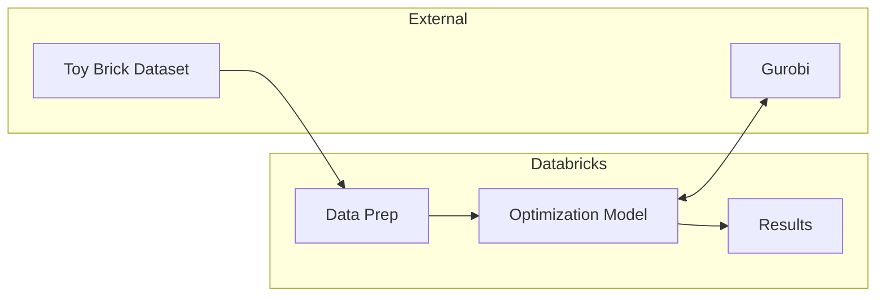

# Assembling Toy Brick Sets with Gurobi & Databricks

This project demonstrates mathematical optimization techniques for solving product assortment problems using toy brick datasets as an example. It leverages Databricks, PySpark, and Gurobi to optimize which toy brick sets can be built from available parts.

## Introduction

- **Optimization Focus**: Shows how mathematical optimization helps find the best decisions while handling real-world constraints
- **Toy Brick Example**: Uses toy brick sets to demonstrate how optimization can maximize value while managing limited resources
- **Technical Stack**: Integrates Gurobi's optimization solver with Databricks for scalable data processing and solution deployment

## Architecture

## Notebooks

1. `01_Prepare_Data.ipynb` - Processes raw toy brick dataset into optimization-ready format
2. `02_Optimization_Model.ipynb` - Introduces optimization concepts with a small example
3. `03_Optimization_Model_Large.ipynb` - Demonstrates large-scale optimization

## Prerequisites

- Databricks Runtime 15.4 LTS or later
- Python 3.10+
- Gurobi License - You have two options:
  - [Commercial License](https://www.gurobi.com/solutions/licensing/)
  - [Databricks-specific Licensing](https://support.gurobi.com/hc/en-us/articles/20659745842961-Databricks-Architecture-and-licensing)

## Usage

1. Set up a Databricks workspace
2. Import notebooks
3. Configure catalog and schema names
4. Run notebooks in sequence

## Key Dependencies

| Library | Description | License | Source |
|---------|-------------|---------|---------|
| Gurobi | Commercial optimization solver for large-scale mathematical programming | Commercial | https://www.gurobi.com/ |

## Contributors

- Linlin Yang (Aimpoint Digital)
- Juan Morinelli (Aimpoint Digital) 
- Peyman Mohajerian (Databricks)
- Bryan Smith (Databricks)

## License

see the LICENSE file for details.

- toy brick dataset is provided by [Rebrickable](https://rebrickable.com) under their [terms of use](https://rebrickable.com/terms/)
- Gurobi Optimizer requires a separate commercial license for full functionality. See [licensing options](https://www.gurobi.com/solutions/licensing/)

## Project support
Please note the code in this project is provided for your exploration only, and are not formally supported by Databricks with Service Level Agreements (SLAs). They are provided AS-IS and we do not make any guarantees of any kind. Please do not submit a support ticket relating to any issues arising from the use of these projects. The source in this project is provided subject to the Databricks License. All included or referenced third party libraries are subject to the licenses set forth below.

Any issues discovered through the use of this project should be filed as GitHub Issues on the Repo. They will be reviewed as time permits, but there are no formal SLAs for support.
