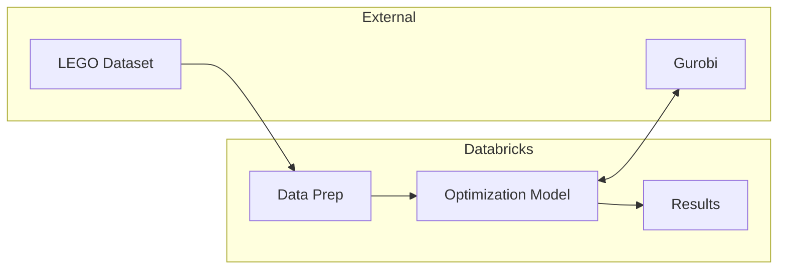

# LEGO Assortment Optimization

This project demonstrates mathematical optimization techniques for solving product assortment problems using LEGO datasets as an example. It leverages Databricks, PySpark, and Gurobi to optimize which LEGO sets can be built from available parts.

## Architecture

## Notebooks

1. `01_Prepare_Data.ipynb` - Processes raw LEGO dataset into optimization-ready format
2. `02_Optimization_Model.ipynb` - Introduces optimization concepts with a small example
3. `03_Optimization_Model_Large.ipynb` - Demonstrates large-scale optimization

## Prerequisites

- Databricks Runtime 15.4 LTS or later
- Python 3.10+
- Gurobi License (commercial license needed for large model)

## Usage

1. Set up a Databricks workspace
2. Import notebooks
3. Configure catalog and schema names
4. Run notebooks in sequence

## Key Dependencies

| Component | License | Purpose |
|-----------|---------|---------|
| Gurobi | Commercial | Optimization solver |
| PySpark | Apache 2.0 | Data processing |
| MLflow | Apache 2.0 | Experiment tracking |
| Pandas | BSD 3-Clause | Data manipulation |

## Contributors

- Juan Morinelli (Aimpoint Digital)
- Linlin Yang (Aimpoint Digital) 
- Peyman Mohajerian (Databricks)
- Bryan Smith (Databricks)

## License

This project is licensed under the Apache 2.0 License - see the LICENSE file for details.

Data sourced from [Rebrickable](https://rebrickable.com/downloads/) under their [terms of use](https://rebrickable.com/terms-of-service/).
